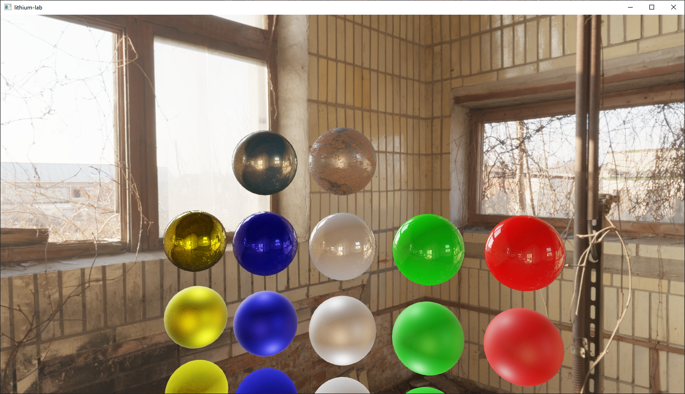
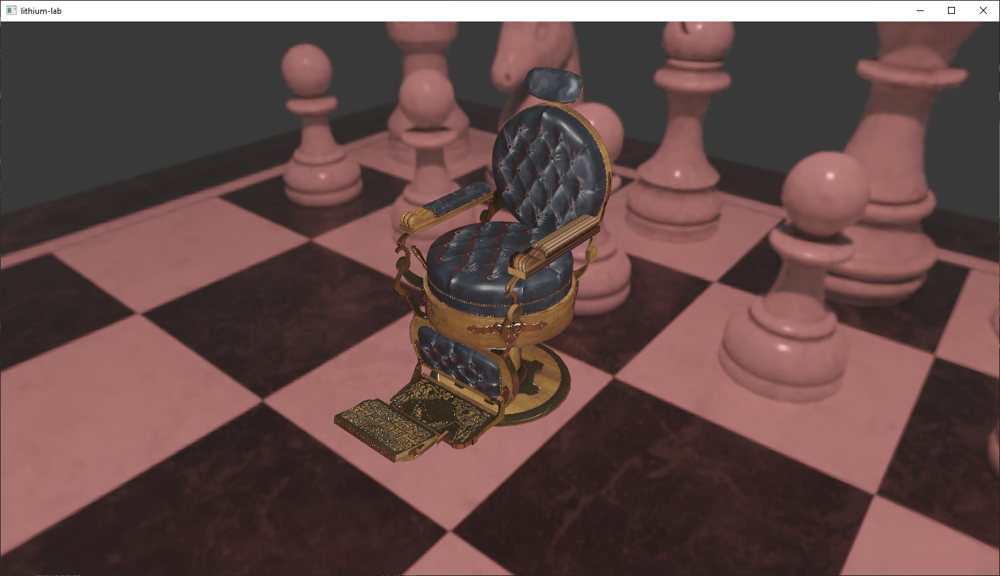
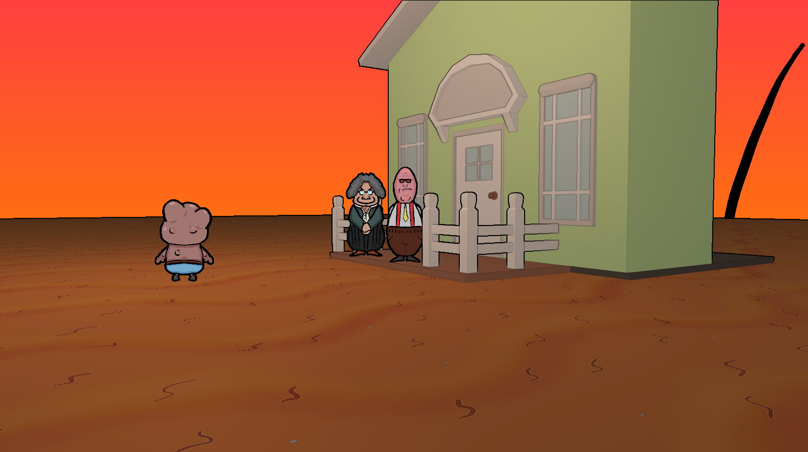
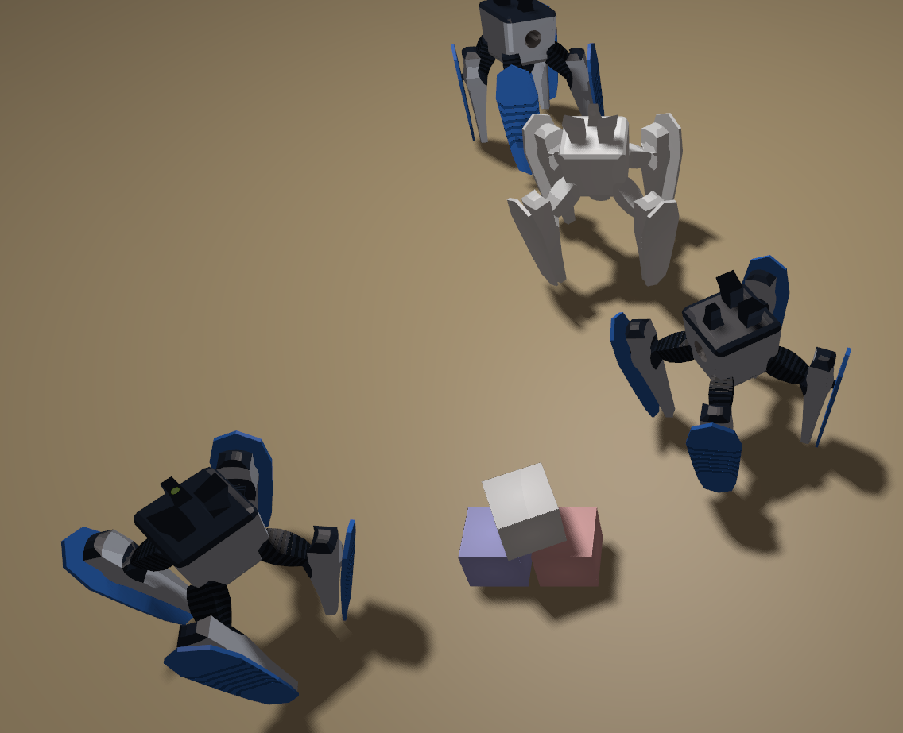
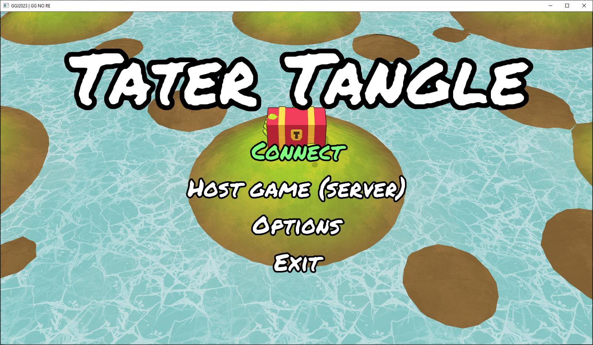
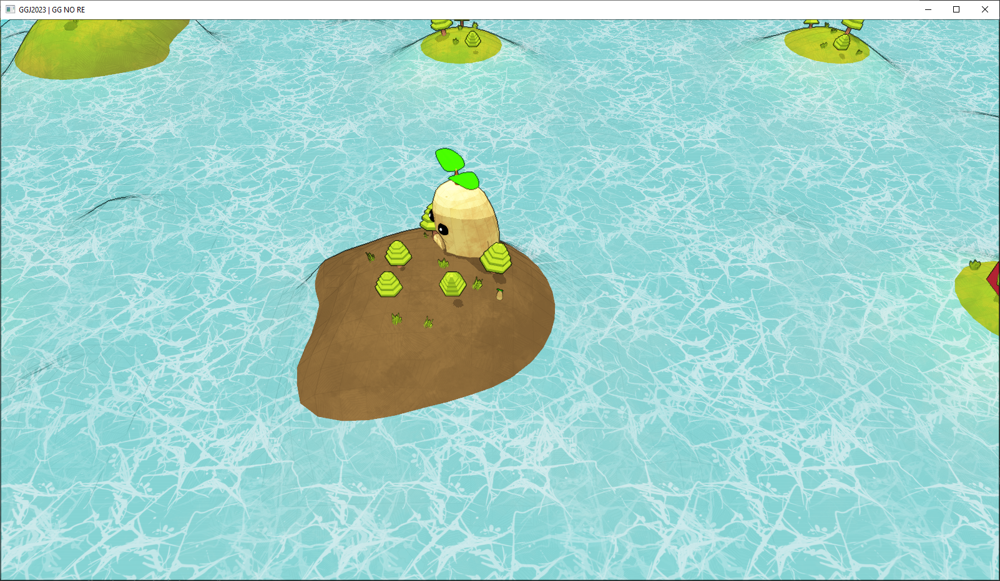
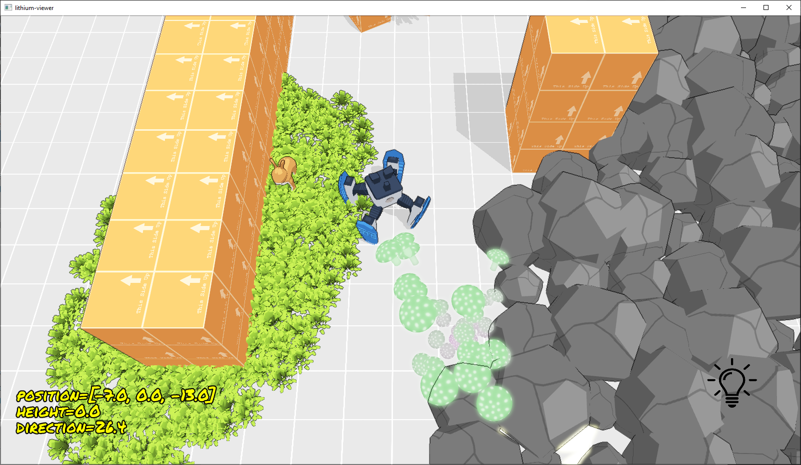
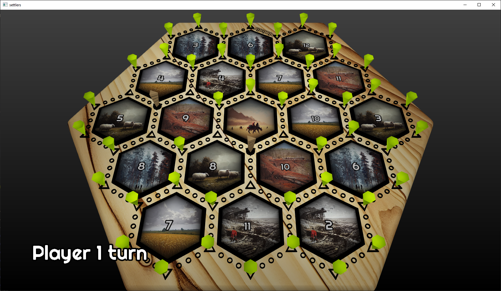

# Lithium Examples
This page aim to showcase some of the capabilities of the lithium game engine.

## Physics Based Rendering
Loading HDR cubemaps from PolyHaven, and rendering spheres with various PBR materials.

## GLTF Model and PBR
Model downloaded from PolyHaven, loaded and rendered in lithium.

## Prototype: First Person Perspective

## Shadow Mapping and Skeletal Animation

Real time shadow mapping of static and skinned/animated meshes.

## Tater Tangle: Game submitted for Global Game Jam 2023
Tiny multiplayer game submitted for GGJ2023. Keep your potato large by visiting the islands to retrieve the nutrients from the ground. Avoid the tidal waves and being headbutted by other players. Made in one weekend using lithium engine.

https://globalgamejam.org/2023/games/tater-tangle-6

## Atowar: Prototype of a third person MOBA-inspired shooter
* Stylized shading, cel shading and outlines
* Skeletal animation
* Particle systems
* Custom collision detection
* Shadow mapping
* UDP mulitplayer protocol, small package sizes (<500B)
* Real time text rendering

## Settlers Mock-up

Small mockup of the popular board game Settlers of Catan.

